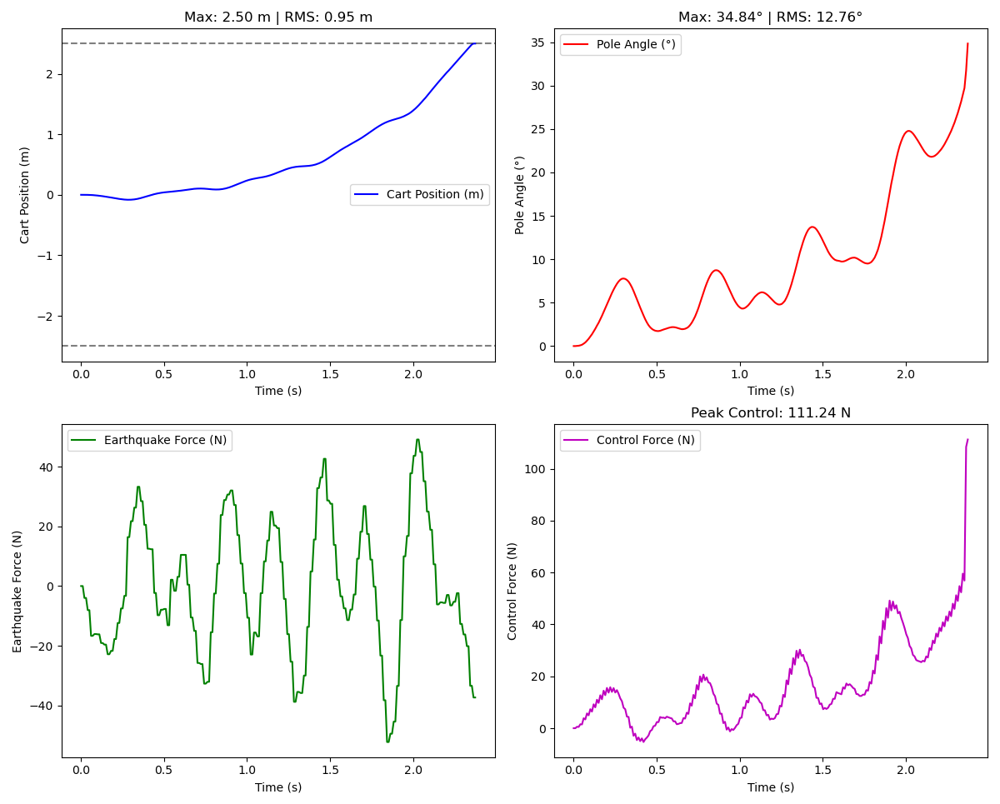
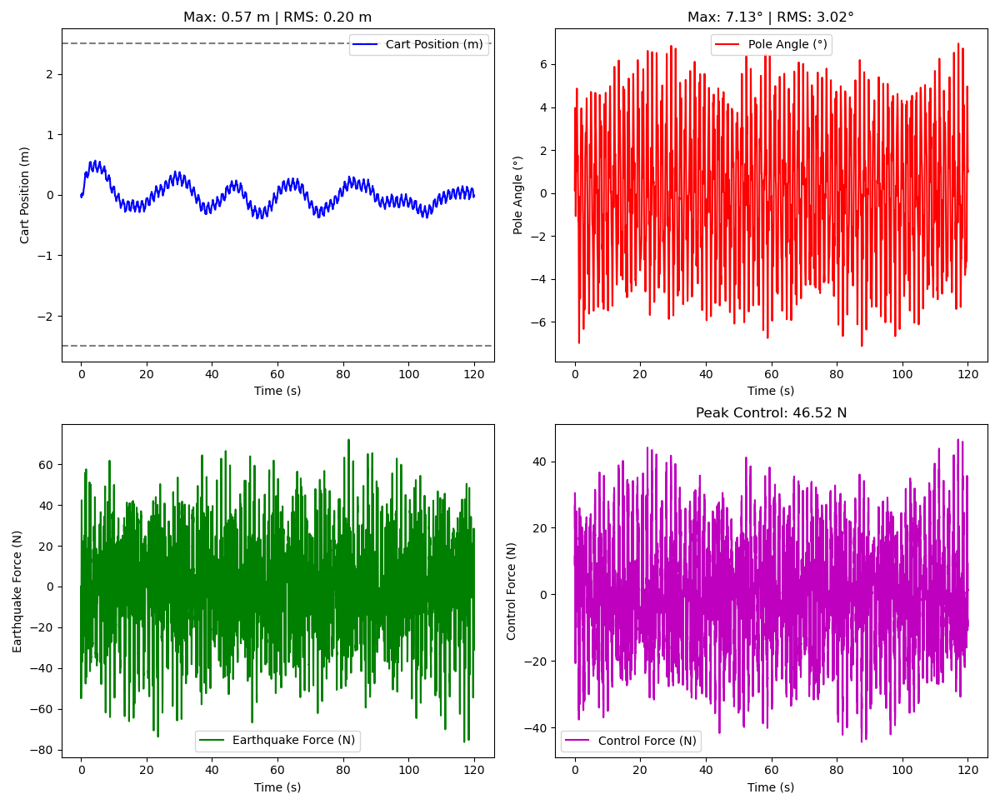
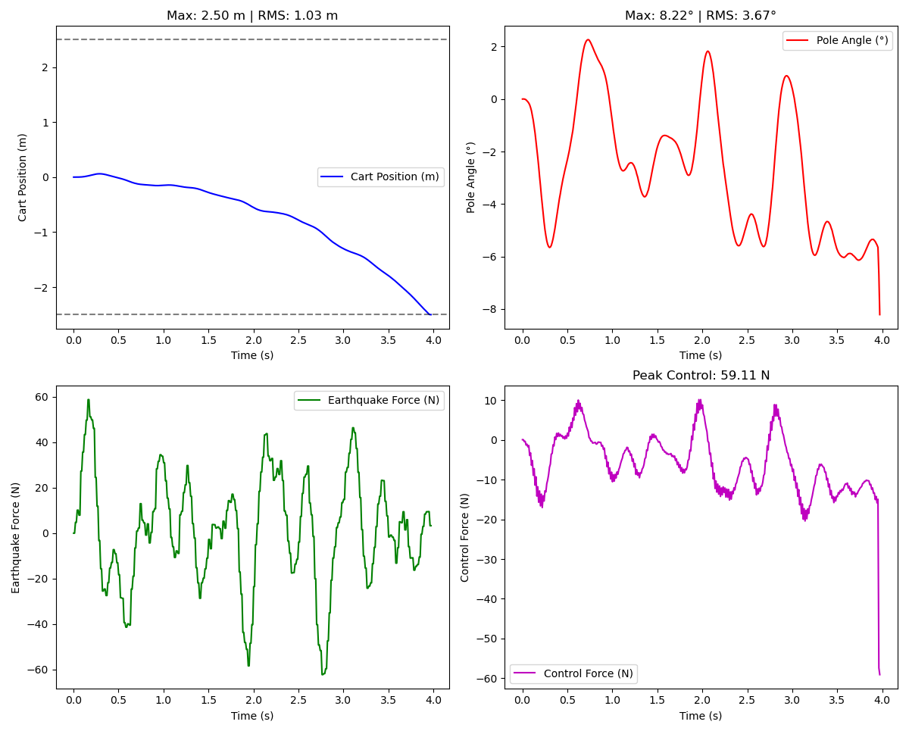
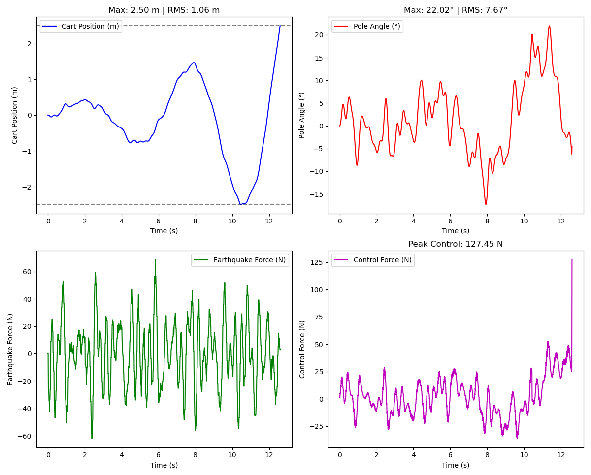
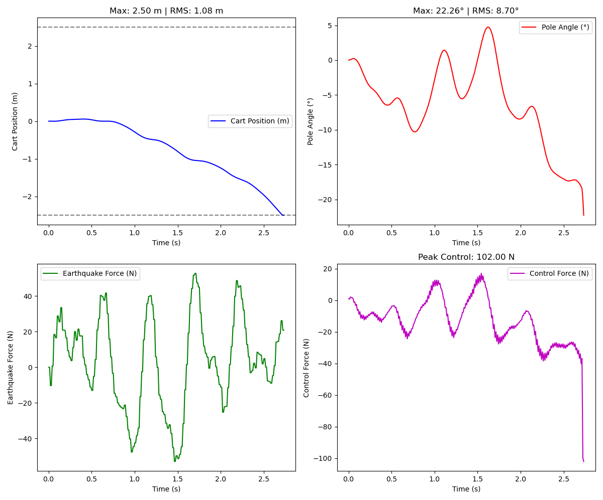

# Cart-Pole Optimal Control Assignment

## Simulation Report
## 1. Introduction

This project evaluates a Linear Quadratic Regulator (LQR) controller
applied to a cart-pole system in a ROS2 + Gazebo simulation environment
under earthquake disturbances.

The system state vector is defined as:

x = $x, x', \theta, \theta'$

Where: - x: Cart position (m) - x': Cart velocity (m/s) - $\theta$: Pole
angle (deg in plots) - $\theta'$: Pole angular velocity

### Control Objectives

1.  Maintain the pendulum in the upright position\
2.  Keep the cart within ±2.5 m physical limits\
3.  Achieve stable operation under earthquake disturbances

------------------------------------------------------------------------

## 2. LQR Design

The LQR cost function is defined as:

J = ∫ (x\^T Q x + u\^T R u) dt

Where:

Q = $(q1, q2, q3, q4)$
R = scalar control penalty

Different Q weight configurations were tested to understand performance
trade-offs between stability, tracking, and control effort.

------------------------------------------------------------------------

## 3. Documenting the LQR Tuning Approach
Based on the cost function $J$, we incrementally applied a heavy penalty (weight = 100) to individual states in the $Q$ matrix to observe the system's behavioral trade-offs.

*   **Baseline ($Q=(1,1,1,1)$):** Failed to prioritize any state. The system quickly lost control, exhibiting a massive pendulum deviation that dragged the cart into the limits.
*   **Penalizing Cart Position $x$ ($Q=(100, 1,1,1)$):** The controller prioritized keeping the cart centered over balancing the pole. While it survived longer (~12.5s) than the baseline, the cart was forced into extreme oscillations, eventually hitting the 2.5m limit.
*   **Penalizing Pole Angle $\theta$ ($Q=(1,1,100,1)$):** The controller prioritized perfectly vertical pole alignment. Because the earthquake constantly perturbated the pole, the cart was forced to move violently to compensate, causing it to crash into the boundary at ~2.7s.
*   **Penalizing Pole Velocity $\dot{\theta}$ ($Q=(1,1,1,100)$):** Trying to stop the pole from rotating caused a similarly aggressive reaction from the cart, leading to failure at ~4.0s.
*   **Penalizing Cart Velocity $\dot{x}$ ($Q=(1,100,1,1,)$):** This approach introduced necessary "damping" into the LQR cost function. By penalizing the speed of the cart, the controller naturally smoothed out its responses to the high-frequency earthquake vibrations. This prevented runaway oscillations and provided the optimal trade-off between balancing the pole and restricting cart displacement.

------------------------------------------------------------------------

## 4. System Performance Analysis
The experimental results yielded the following precise performance metrics:

| Tuning Configuration | Penalty Focus | Stable Duration | Max Displacement (Limit 2.5m) | Max Pendulum Angle | Peak Control Effort |
| :--- | :--- | :--- | :--- | :--- | :--- |
| **`default`**  | None | ~2.4 s | 2.50 m (Failure) | 34.84° | 111.24 N |
| **`q_100_1_1_1`**  | Cart Pos ($x$) | ~12.5 s | 2.50 m (Failure) | 22.02° | 127.45 N |
| **`q_1_100_1_1`** | **Cart Vel ($\dot{x}$)**| **120.0 s (Stable)**| **0.57 m (Stable)** | **7.13°** | **46.52 N** |
| **`q_1_1_100_1`**  | Pole Angle ($\theta$) | ~2.7 s | 2.50 m (Failure) | 22.26° | 102.00 N |
| **`q_1_1_1_100`**  | Pole Vel ($\dot{\theta}$) | ~4.0 s | 2.50 m (Failure) | 8.22° | 59.11 N |

Noticeably, the optimal configuration (`q_1_100_1_1`) not only achieved total stability but also required the lowest peak control force (46.52 N). This means it was the most energy-efficient control law, preventing the actuator saturation seen in the failing configurations.

------------------------------------------------------------------------

## 5. Detailed Case Result


### Case 1: Baseline Configuration

Q = (1,1,1,1)

-   Max cart displacement: 2.50 m (boundary reached)
-   RMS cart position: 0.95 m
-   Max pole angle: 34.84°
-   RMS pole angle: 12.76°
-   Peak control force: 111.24 N

**Observation:**
Applying equal weights is entirely insufficient for continuous disturbance rejection, causing the system to fail at approximately 2.4 seconds. The controller loses control of the pendulum almost immediately, resulting in massive pole angle deviations and a rapid crash into the physical limits.


------------------------------------------------------------------------

### Case 2: High Cart Velocity Weight

Q = (1,100,1,1)

-   Max cart displacement: 0.57 m
-   RMS cart position: 0.20 m
-   Max pole angle: 7.13°
-   RMS pole angle: 3.02°
-   Peak control force: 46.52 N

**Observation:**
The system remained stable for the full 120-second duration. Both cart displacement and pole deviation were significantly reduced. Control effort remained moderate, requiring the lowest peak force among all cases. This configuration provided necessary damping, showing strong disturbance rejection and balanced behavior.


------------------------------------------------------------------------

### Case 3: High Angular Velocity Weight

Q = (1,1,1,100)

-   Max cart displacement: 2.50 m (physical boundary reached)
-   RMS cart position: 1.03 m
-   Max pole angle: 8.22°
-   RMS pole angle: 3.67°
-   Peak control force: 59.11 N

**Observation:**
The system failed and hit the physical boundary at approximately 4.0 seconds. While attempting to stop the pole from rotating kept the angle relatively small, it caused the cart to drift and eventually reach its physical limits. Emphasizing angular velocity alone does not prevent long-term drift under continuous disturbances.


------------------------------------------------------------------------

### Case 4: High Cart Position Weight

Q = (100,1,1,1)

-   Max cart displacement: 2.50 m (boundary reached)
-   RMS cart position: 1.06 m
-   Max pole angle: 22.02°
-   RMS pole angle: 7.67°
-   Peak control force: 127.45 N

**Observation:**
The system survived longer than the baseline but eventually failed around 12.5 seconds. Prioritizing keeping the cart centered forced extreme cart oscillations to compensate, leading to large pole deviations. This configuration required the highest peak control force of all tests.


------------------------------------------------------------------------

### Case 5: High Pole Angle Weight

Q = (1,1,100,1)

-   Max cart displacement: 2.50 m (boundary reached)
-   RMS cart position: 1.08 m
-   Max pole angle: 22.26°
-   RMS pole angle: 8.70°
-   Peak control force: 102.00 N

**Observation:**
The system failed rapidly at roughly 2.7 seconds. Increasing the pole angle weight caused overly aggressive control actions by the cart in an attempt to keep the pole perfectly vertical during the earthquake. Large control forces were exerted, directly leading to rapid boundary excursions.


------------------------------------------------------------------------

## 6. Conclusion

The experiments demonstrate that LQR performance strongly depends on the
relative weighting of state variables in the Q matrix. Under earthquake
disturbances, prioritizing angular velocity provided the most stable and
energy-efficient behavior. However, no configuration perfectly enforced
cart position constraints, highlighting a limitation of pure LQR without
additional constraint handling or state augmentation.

------------------------------------------------------------------------

## RL notes
start with a clean ROS env
```bash
unset AMENT_PREFIX_PATH
unset PYTHONPATH
unset COLCON_PREFIX_PATH
```
install packages:
```bash
# configure repos (only if you haven't already — follow ROS jazzy apt setup)
sudo apt update

# attempt to install the ros_gz vendor metapackage (replace $ROS_DISTRO if needed)
sudo apt install ros-$ROS_DISTRO-ros-gz
sudo apt install ros-jazzy-ros-gz-sim
```

End of Report

