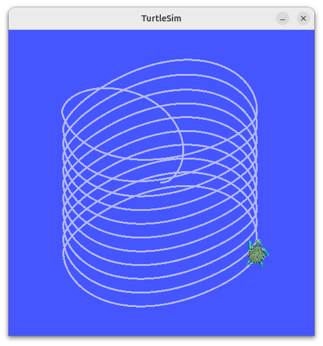
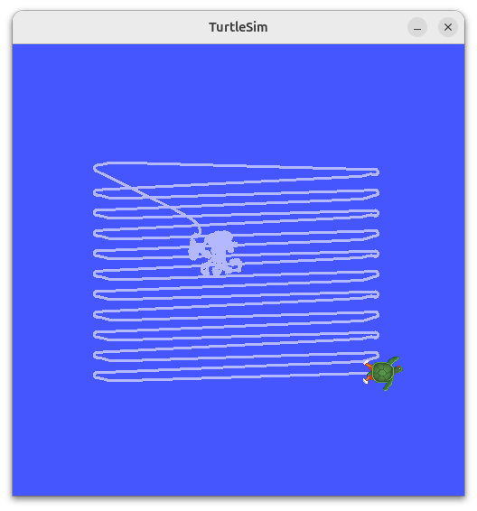
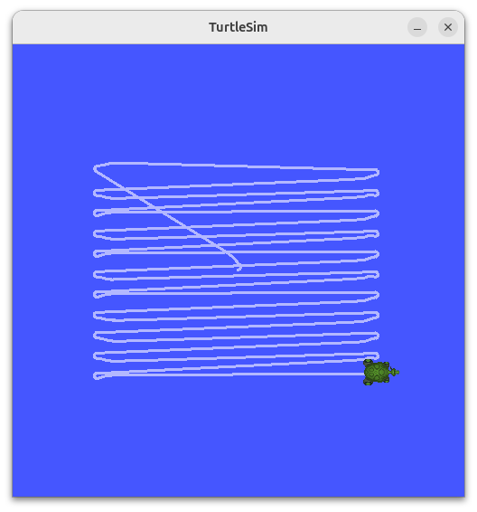
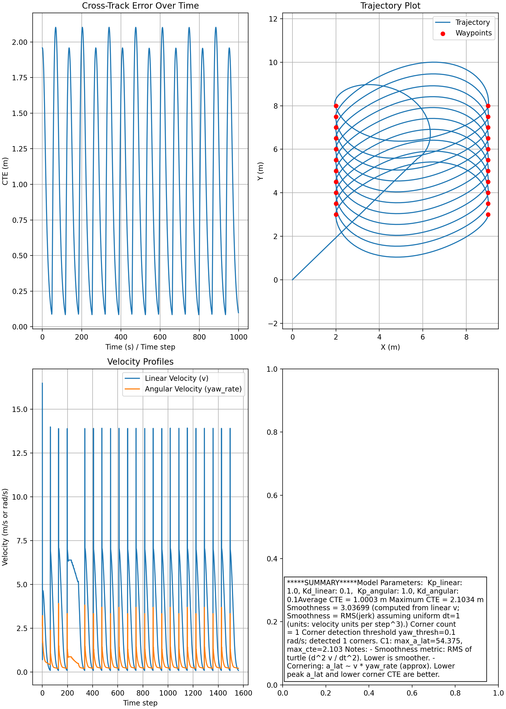
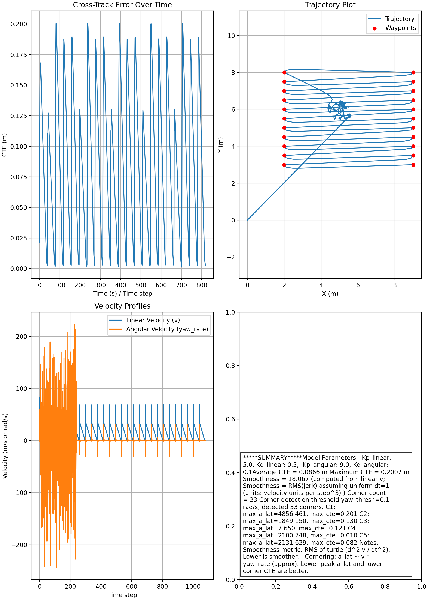

# First-Order Boustrophedon Navigator

## RL: to run
```bash
source /opt/ros/jazzy/setup.bash
source ~/ros2_ws/install/setup.bash

ros2 launch first_order_boustrophedon_navigator boustrophedon.launch.py
ros2 topic echo /cross_track_error
ros2 run rqt_plot rqt_plot
```

after update code:
```bash
cd ~/ros2_ws
colcon build --packages-select first_order_boustrophedon_navigator
```

adjust parameters on the fly:
```bash
ros2 param set /lawnmower_controller Kd_angular 4.0
ros2 param set /lawnmower_controller Kp_angular 4.5
ros2 param set /lawnmower_controller Kp_linear 1.0
ros2 param set /lawnmower_controller Kd_linear 0.5
```

# Homework Result

 First Order Boustrophedon Navigator

## Final Parameter Values & Justification

After a two-stage tuning process involving automated optimization and manual refinement, the following PID parameters were selected. These values transition the robot from the unstable spiral behavior (Pic 1) to the stable rectangular path (Pic 2).

| Parameter | Value | Justification |
| :--- | :--- | :--- |
| **`Kp_linear`** | **5.0** | High linear gain caused the robot to rush into turns with enough momentum, and manageable speed. |
| **`Kd_linear`** | **0.5** | Standard damping to prevent linear overshoot when approaching waypoints. |
| **`Kp_angular`** | **9.0** | Increasing the initial value 1.0 to 9.0 forces the robot to turn sharply enough to fit within the lane. |
| **`Kd_angular`** | **0.1** | Keep the same as initial value |
| **`spacing`** | **0.5** | Kept constant to define the survey density|

## Performance Metrics & Analysis

### Trajectory Comparison
*   **Baseline (Figure 1):** With default parameters, the robot failed to close the loop on turns, resulting in an infinite "Spiral of Death" where the turn radius exceeded the lane spacing.
**Figure 1: Baseline**

*   **Manual tunning process (Figure 2):** With best parameters got from the optimizer, the robot failed to close the loop on turns, resulting in an infinite "Spiral of Death" where the turn radius exceeded the lane spacing. After manual tuning on the fly of the simulation, the robot found ways to survey the field.
**Figure 2: Tuning**

*   **Optimized (Figure 2):** With the final tuned parameters, the robot successfully executes 180-degree turns within the 0.5m spacing constraint, producing a clean Boustrophedon (lawnmower) pattern.
**Figure 3: Final**

### Error Analysis
*   **Cross-Track Error:** The error spikes momentarily during the instantaneous 180-degree turns but rapidly converges to near-zero on straight legs due to the stable linear gain.
*   **Velocity Profile:** The robot maintains a consistent speed on straights and executes rapid, high-velocity rotations (spikes in angular velocity) to maintain the path.
*   **Profile Through 3 Patterns:** 

| Metric | **Baseline** | **Manual Tuning** | **Final**|
| :--- | :--- | :--- | :--- |
| **Model Parameters** | `Kp_lin`: 1.0, `Kd_lin`: 0.1<br>`Kp_ang`: 1.0, `Kd_ang`: 0.1 | `Kp_lin`: 5.0, `Kd_lin`: 0.5<br>`Kp_ang`: 9.0, `Kd_ang`: 0.1 | `Kp_lin`: 5.0, `Kd_lin`: 0.5<br>`Kp_ang`: 9.0, `Kd_ang`: 0.1 |
| **Average CTE** | **1.0003 m** | **0.0866 m** | **0.0828 m** |
| **Maximum CTE** | 2.1034 m | 0.2007 m | 0.2045 m |
| **Smoothness**<br>*(RMS Jerk, lower is better)* | **3.037** | **18.067** | **20.565** |
| **Corner Count** | 1 | 33 | 33 |
| **Max Lateral Accel**<br>*(`max_a_lat`)* | **54.375** | **4856.461** | **1092.420** |

### Data Analysis
*   **Baseline(The Spiral):** The data shows a very low **Smoothness score (3.037)**, indicating the robot moved very smoothly. However, the **Average CTE (1.0003 m)** is massive, quantitatively confirming the robot failed to track the path entirely (spiraling outward).
*   **Final:** The high gains (`Kp_angular`: 9.0) successfully forced the **Average CTE down to ~0.08 m** , meaning the robot stayed tightly on the line. However, the **Smoothness score spiked to ~18-20**, confirming the "shaking" behavior observed in the trajectory plots.

### Result Plots 
 
 


## Tuning Methodology

### 1. Automated Optimization (boustrophedon_optimizer.py)
I used `boustrophedon_optimizer.py` to search for optimal gains.
*   **Result:** The optimizer suggested extremely aggressive gains (e.g., `Kp_linear` $\approx$ 5.0, `Kp_angular` $\approx$ 9.2) .
*   **Failure:** When applied to the actual ROS 2 node, these parameters performed poorly. The robot struggled to move in a straight line and exhibited severe "shaking and twisting." .

### 2. Real-Time Manual Refinement (ros2 param set)
To fix the instability, I switched to manual tuning using the ROS 2 CLI while the controller was running.
*   **Step 1:** I utilized the `ros2 param set /lawnmower_controller Kd_angular 0.1` feature in the controller to adjust gains on the fly.
*   **Step 2:** I updated `Kp_linear` from 1.0 to 5.0 to increase the robot's kinetic energy entering turns.
*   **Step 3:** I drastically increased `Kd_angular` to 9.0. This provided the necessary damping to stop the oscillation (shaking) induced by the high turning gain.
*   **Step 4:** I found `Kp_angular` = 0.1 to make the tight U-turn, but low enough to remain stable.

## Challenges and Solutions

### Challenge 1: Optimizer Instability
**Issue:** `boustrophedon_optimizer.py` produced parameters that caused severe oscillation.
**Solution:** I treated the optimizer results as a "theoretical upper bound" and manually added significant derivative damping (`Kd`) to compensate for the unmodeled dynamics.

### Challenge 2: Environment Restrictions
**Issue:** Installing `optuna` failed due to "externally managed environment" errors on Linux.
**Solution:** I utilized `pip install optuna --break-system-packages` to enable the optimization script in the development environment.


# Original Readme
## Submission Requirements

1. GitHub Repository:
   - Commit messages should be descriptive

2. Documentation in Repository:
   - Update the README.md in your fork with:
     - Final parameter values with justification
     - Performance metrics and analysis
     - Plots showing:
       - Cross-track error over time
       - Trajectory plot
       - Velocity profiles
     - Discussion of tuning methodology
     - Challenges and solutions

3. Submit your work:
   - Submit the URL of your GitHub repository
   - Ensure your repository is public
   - Final commit should be before the deadline


## Tips for Success
- Start with low gains and increase gradually
- Test one parameter at a time
- Pay attention to both straight-line tracking and cornering
- Use rqt_plot to visualize performance in real-time
- Consider the trade-off between speed and accuracy

## Grading Rubric
- Perfect tracking (cross-track error < 0.2 units): 100%
- Good tracking (cross-track error < 0.5 units): 90%
- Acceptable tracking (cross-track error < 0.8 units): 80%
- Poor tracking (cross-track error > 0.8 units): 60% or lower

Note: Final grade will also consider documentation quality and analysis depth.

## Extra Credit (10 points)
Create and implement a custom ROS2 message type to publish detailed performance metrics:
- Define a custom message type with fields for:
  - Cross-track error
  - Current velocity
  - Distance to next waypoint
  - Completion percentage
  - Other relevant metrics
- Implement the message publisher in your node
- Document the message structure and usage

This will demonstrate understanding of:
- ROS2 message definitions
- Custom interface creation
- Message publishing patterns

## Acknowledgements: Aldrin Inbaraj A, Arizona State University. 

